# Proyecto SQL-Server-Commercial-Analytics
Proyecto Integral de SQL Server para Analitica de Negocios


## Resumen (overview)
### Sobre el negocio
Corwell Group es una empresa de distribución y venta retail de multicategoría con operaciones y presencia en Estados Unidos.

El departamento de estrategia comercial de Corwell Group desea identificar en qué productos, categorías y mercados regionales debe enfocar sus esfuerzos de crecimiento y rentabilidad, priorizando decisiones de portafolio sobre una base de datos sólida en lugar de intuición.

### Objetivo del proyecto
_Utilizar el lenguaje **SQL** dentro del entorno de **SQL Server Management Studio**_ para estructurar, normalizar y realizar análisis exploratorio de la información transaccional del negocio con el fin de entregar al área comercial recomendaciones accionables que permitan implementar mejoras practicas en su estrategia comercial, optimizar sus procesos y aumentar la rentabilidad._

### Herramientas y Metodología

- **Motor de Base De Datos**: SQL Server Management Studio (SMSS)
- **Lenguaje**: SQL (DDL, DML, DQL)
- **Metodología**: Limpieza de Datos (Data Cleaning), Análisis Exploratorio de Datos(EDA) y Generación de Insights Accionables.


## Estructura del Proyecto
- [Sobre los Datos](#sobre-los-datos)
- [Tareas](#tareas)
- [Arquitectura y Modelado de Datos](#arquitectura-y-modelado-de-datos)
- [Limpieza de Datos](#limpieza-de-datos)
- [Análisis Exploratorio de Datos e Insights](#análisis-exploratorio-de-datos-e-insights)
- [Conclusiones y Recomendaciones](#conclusiones-y-recomendaciones)

## Sobre los datos

El proyecto utiliza un dataset que está compuesto por una tabla con 200,000 registros distribuidos en 14 columnas, el cual contiene información sobre las transacciones de ventas de una empresa retail como: fecha de transacción, información del cliente, producto, cantidad, precio unitario, ingreso y ganancia.

Se puede acceder al dataset original [aquí](https://www.kaggle.com/datasets/yashyennewar/product-sales-dataset-2023-2024).

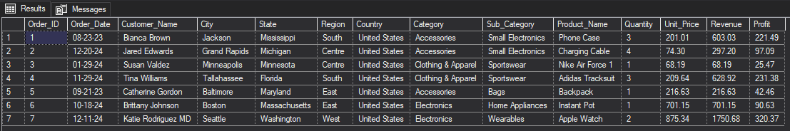

A continuación se muestra la estructura de las tablas del dataset:

### Estructura del archivo `sales.csv`

| Columna | Descripción |
|----------|-------------|
| Order_ID | Identificador único de cada pedido. |
| Order_Date | Fecha en la que se realizó la transacción. |
| Customer_Name | Nombre del cliente que realizó la compra. |
| City | Ciudad de residencia del cliente. |
| State | Estado de residencia del cliente. |
| Region | Región geográfica donde se ubica el cliente (Este, Oeste, Sur o Centro). |
| Country | País donde se realizó la venta (Estados Unidos). |
| Category | Categoría principal del producto (por ejemplo, Accesorios, Ropa y Vestimenta). |
| Sub_Category | Subcategoría del producto dentro de la categoría principal (por ejemplo, Ropa deportiva, Bolsos). |
| Product_Name | Nombre o descripción del producto comercializado. |
| Quantity | Cantidad de unidades compradas. |
| Unit_Price | Precio unitario del producto, expresado en dólares estadounidenses (USD). |
| Revenue | Ingresos totales generados por la venta, calculados como **Cantidad × Precio Unitario**. |
| Profit | Ganancia neta obtenida en la transacción. |

## Tareas (Task)

En este proyecto, se ayudará al departamento comercial de Corwell Group a responder lo siguiente:

1. **Ingreso y Margen Total por Cateogoría de Producto:** 
¿Cuál es el ingreso total y la ganancia total generados por cada categoría de producto, y qué porcentaje de margen representa cada una?

2. **Mejores Productos del Catálogo Por Margen:** ¿Cuáles son los 10 productos que generan mayor ingreso para la empresa?

3. **Ventas Totales por Región:** ¿Cómo se comparan las ventas totales, la ganancia y el número de órdenes entre las 4 regiones donde opera Corwell Group?

4. **Rentabilidad de los productos:** ¿Cómo se puede clasificar a cada producto según su nivel de rentabilidad (alta, media o baja) para priorizar decisiones comerciales?

5. **Evolución Mensual de Ingresos:** ¿Cómo ha evolucionado el ingreso mes a mes durante 2023 y 2024? ¿Existen patrones de estacionalidad?

6. **Distribución de Ingresos por Estado:** ¿Qué estados concentran el 80% del ingreso total de la empresa? ¿Vale la pena distribuir el esfuerzo comercial por igual entre todos los estados?

7. **Frecuencia de compra por cliente:** ¿Qué proporción de clientes ha realizado más de una compra, frente a los que solo compraron una vez?

8. **Tasa de crecimiento mensual por categoría:** ¿Cuál es la tasa de crecimiento mes a mes del ingreso por categoría de producto, y qué categorías muestran una tendencia sostenida de crecimiento o caída?

9. **Matriz de desempeño Categoría Región:**¿Qué combinaciones de categoría y región presentan el mejor y el peor desempeño conjunto de ingreso y margen?

## Arquitectura y Modelado de Datos

El dataset original consistía en un archivo plano desnormalizado en formato (.csv). Para optimizar el almacenamiento y facilitar el análisis, se optó por diseñar un modelo relacional de datos para el almacenamiento y segmentación de la infrormación. Este modelo  se compone de las siguientes tablas:

- `Dim_Customers`: (Dimensión de Clientes) Contiene nombres y apellidos del cliente.
- `Dim_Geography`: (Dimensión de Geografía) Contiene información geográfica como ciudad, estado, región y país.
- `Dim_Products`: (Dimensión de Productos) Contiene información de los productos como nombre, categoría y subcategoría.
- `Fact_Sales`: (Tabla de Hechos de Ventas) Contiene información sobre las ventas como fecha de transacción, cantidad, precio unitario, ingreso y ganancia.

```sql
-- ==============================
-- 1. NORMALIZACION DE LA DATA
-- ==============================

-- ===============================================
-- a) Tabla Dimensional de Clientes (Dim_Customer)
-- ===============================================

-- Creación de tabla Dim_Customer

CREATE TABLE Dim_Customer (
	Customer_ID		INT IDENTITY(101,1) NOT NULL,
	Customer_Name	VARCHAR(100) NOT NULL,
	CONSTRAINT PK_Dim_Customer PRIMARY KEY (Customer_ID) );

-- Inserción de Data en Dim_Customer

INSERT INTO Dim_Customer (Customer_Name)
	SELECT 
		DISTINCT Customer_Name
	FROM sales
;

-- ===============================================
-- b) Tabla Dimensional de Productos (Dim_Product)
-- ===============================================

-- Creación de tabla Dim_Product

CREATE TABLE Dim_Product (
	Product_ID		INT IDENTITY(1,1) NOT NULL,
	Product_Name	VARCHAR(100) NOT NULL,
	Sub_Category	VARCHAR(50),
	Category		VARCHAR(50),
	CONSTRAINT PK_Dim_Product PRIMARY KEY (Product_ID) ) ;

-- Inserción de Data en Dim_Product

INSERT INTO Dim_Product (Product_Name, Sub_Category, Category)
	SELECT 
		DISTINCT Product_Name,
		Sub_Category,
		Category
	FROM sales
	ORDER BY Category ASC, Sub_Category ASC, Product_Name ASC;

-- ===============================================
-- c) Tabla Dimensional de Geography (Dim_Geography)
-- ===============================================

-- Creación de tabla Dim_Geography

CREATE TABLE Dim_Geography (
	Geo_ID			INT IDENTITY(1,1) NOT NULL,
	City			VARCHAR(100),
	State			VARCHAR(50),
	Region			VARCHAR(20),
	Country			VARCHAR(50),
	CONSTRAINT PK_Dim_Geography PRIMARY KEY (Geo_ID) ) ;

-- Inserción de Data en Dim_Geography

INSERT INTO Dim_Geography (City, State, Region, Country)
	SELECT
		DISTINCT City,
		State,
		Region,
		Country
	FROM sales 
	ORDER BY Region ASC, State ASC, City ASC

-- ===============================================
-- d) Tabla de Hechos de Ventas (Fact_Sales)
-- ===============================================

-- Creación Tabla De Hechos de Ventas (Fact_Sales)

CREATE TABLE Fact_Sales (
	Order_ID		INT NOT NULL,
	Customer_ID		INT NOT NULL,
	Product_ID		INT NOT NULL,
	Geo_ID			INT NOT NULL,
	Order_Date		DATE NOT NULL,
	Quantity		INT,
	Unit_Price		DECIMAL(10,2),
	Revenue			DECIMAL(10,2),
	Profit			DECIMAL(10,2),
	CONSTRAINT PK_Fact_Sales PRIMARY KEY (Order_ID),
	CONSTRAINT FK_Fact_Customer FOREIGN KEY (Customer_ID)
		REFERENCES Dim_Customer(Customer_ID),
	CONSTRAINT FK_Fact_Product FOREIGN KEY (Product_ID)
		REFERENCES Dim_Product(Product_ID),
	CONSTRAINT FK_Fact_Geo FOREIGN KEY (Geo_ID)
		REFERENCES Dim_Geography(Geo_ID),
	CONSTRAINT CHK_Quantity CHECK(Quantity > 0),
	CONSTRAINT CHK_Unit_Price CHECK(Unit_Price >= 0),
	CONSTRAINT CHK_Revenue CHECK(Revenue >= 0)
);

-- Inserción de Data en Fact_Sales

INSERT INTO Fact_Sales(Order_ID, Customer_ID, Product_ID, Geo_ID, Order_Date, Quantity, Unit_Price, Revenue, Profit)
SELECT
		s.Order_ID,
		c.Customer_ID,
		p.Product_ID,
		g.Geo_ID,
		FORMAT(CAST(s.Order_Date as date), 'yyyy-MM-dd') AS Order_Date,
		s.Quantity,
		s.Unit_Price,
		s.Revenue,
		s.Profit
FROM sales s
JOIN Dim_Customer c ON c.Customer_Name = s.Customer_Name
JOIN Dim_Product p ON p.Product_Name = s.Product_Name
					AND p.Sub_Category = s.Sub_Category
					AND p.Category = s.Category
JOIN Dim_Geography g ON g.City = s.City
					AND g.State = s.State
					AND g.Region = s.Region
					AND g.Country = s.Country;
```

A continuación se muestra el diagrama entidad-relación del modelo relacional de datos:

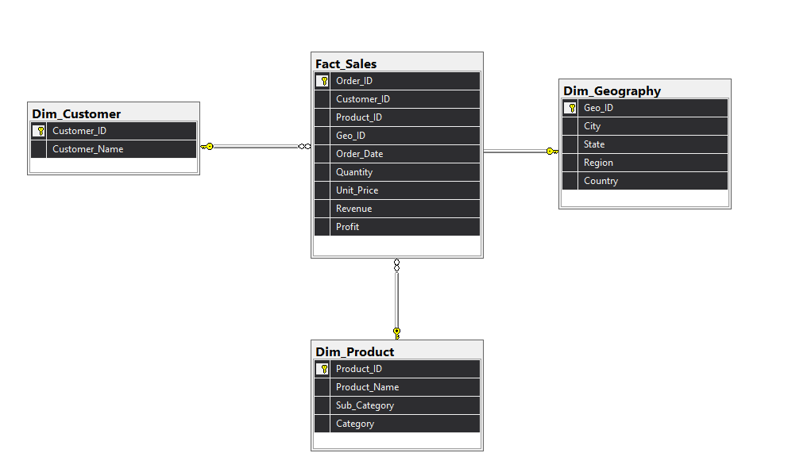

## Limpieza de datos
Antes de realizar el análisis, es fundamental asegurar que los datos estén limpios y completos. Se deben verificar la integridad de los datos, la consistencia de las fórmulas y la calidad de los registros. Los pasos realizados en esta etapa fueron:

### 1. Verificación de valores nulos o faltantes:

Se verificó la existencia de valores faltantes en los campos clave dentro de la tabla `sales`: 
- `Order_ID`
- `Order_Date`
- `Customer_Name`
- `City`
- `Quantity`
- `Unit_Price`
- `Revenue`
- `Profit`

No se encontraron valores nulos o faltantes.


```sql
-- =============================
-- Valores Nulos o Faltantes
-- =============================

-- Verificacion de valores faltantes en la tabla Dim_Customer

SELECT COUNT(1) as ValoresFaltantesCustomer
FROM Dim_Customer
WHERE Customer_Name is NULL;

-- Verificación de valores faltantes en la tabla Dim_Product

SELECT COUNT(1) as ValoresFaltantesProduct
FROM Dim_Product
WHERE Product_Name is NULL
		or Category is NULL
		or Sub_Category is NULL;

-- Verificacion de valores faltantes en la tabla Dim_Geography

SELECT COUNT(1) as ValoresFaltantesGeo
FROM Dim_Geography
WHERE City is NULL 
		or State IS NULL
		or Region IS NULL
		or Country IS NULL;

-- Verificacion de valores faltantes en la tabla Fact_Sales

SELECT COUNT(1) as ValoresFaltantesFact
FROM Fact_Sales
WHERE  Order_ID IS NULL
	OR Order_Date IS NULL
    OR Quantity IS NULL
    OR Unit_Price IS NULL
    OR Revenue IS NULL
    OR Profit IS NULL;
```
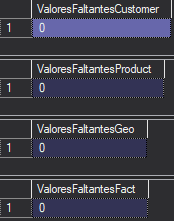

### 2. Verificación de valores duplicados:
A continuación, se procede a verificar la existencia de valores duplicados en los campos clave. No se encontraron duplicados.

```sql
-- =============================
-- Valores Duplicados
-- =============================

-- Verificacion de valores duplicados en la tabla Fact_Sales

SELECT Order_ID, COUNT(1) as ValoresDuplicados
FROM Fact_Sales
GROUP BY Order_ID
HAVING COUNT(1) > 1;
```


### 3. Verificación de inconsistencias:
A continuación, se procede a verificar incosistencias en los campos clave. No se encontraron incosistencias

```sql
-- ================================
-- Verificacion de Inconsistencias
-- ===============================

-- Verificacion de Formulas en Campos Calculados de Revenue

SELECT COUNT(1) AS CalculoIncorrecto
FROM sales
WHERE ROUND(Unit_Price * Quantity, 2) <> Revenue;

-- Verificacion de inconsistencia (se debe verificar que Profit no exceda a Revenue)

SELECT COUNT(1) AS Inconsistencia_Profit_Revenue
FROM sales
WHERE Profit > Revenue;
;
```
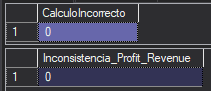

## Análisis Exploratorio de Datos e Insights

### 1.  Ingreso y Margen Total por Categoria de Producto

#### ¿Cual es el ingreso total y la ganancia total generados por cada categoría de producto, y que porcentaje de margen representa cada una?

Se determinó el Ingreso y Margen Total utilizando las funciones SUM, GROUP BY, y CAST para transformar los valores a formatos decimales. 

Además se aplicó la función FORMAT para modificar la visualización de los valores en miles.

Para poder relacionar los datos de la tabla Fact_Sales con los de la tabla Dim_Product, se realizó una inner join entre ambas tablas utilizando el campo Product_ID.

```sql
SELECT 
	p.Category,
	FORMAT(SUM(f.Revenue), 'N2') AS  IngresoTotal,  -- Formato de Separación
	FORMAT(SUM(f.Profit), 'N2') AS MargenTotal,		-- Formato de Separación
	CAST(	
		(SUM(f.Profit) * 100.0)/ SUM(f.Revenue) AS DECIMAL(10,2) 
		) AS [PctMargen (%)]
FROM Fact_Sales AS f
INNER JOIN Dim_Product AS p ON p.Product_ID  = f.Product_ID
GROUP BY p.Category
ORDER BY 
	[PctMargen (%)] DESC;
```

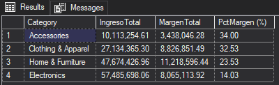

**Insight:** 

- La categoría _Accessories_ tuvo el mayor porcentaje de margen con 34.0 % seguido de cerca por _Clothing & Apparel_ con 32.53 %. Sin embargo, ambas categorías representan el menor ingreso de todas, con $10.1 Millones y $27.1 Millones respectivamente.
- Por otro lado, la categoría _Electronics_ se identifico como la que posee el menor porcentaje de margen con 14.03% y a su vez es la que tiene mayores ingresos con $57.5 Millones.
- Se sugiere una revisión de la estructura de Costos de la categoría _Electronics_ al ser la categoría que más factura pero que menos margen brinda a la empresa.
- El negocio podría enfocarse en potenciar el margen de la categoría _Electronics_ y además modificar la estrategia comercial para las categorías _Accessories_ y _Clothing & Apparel_ con el objetivo de aumentar la rentabilidad general del negocio.


### 2.  Mejores Productos del Catálogo por Margen

Se encontró los 10 productos con mayores ingresos de la empresa utilizando las funciones TOP, SUM, GROUP BY y ORDER BY.

#### ¿Cuales son los productos que generan mayor margen para la empresa?

```sql
SELECT TOP 10
	p.Product_Name,
	FORMAT(SUM(f.Revenue), 'N2') AS  IngresoTotal,
	FORMAT(SUM(f.Profit), 'N2') AS MargenTotal,
	CAST(	
		(SUM(f.Profit) * 100.0)/ SUM(f.Revenue) AS DECIMAL(10,2) 
		) AS [PctMargen (%)]
FROM Fact_Sales AS f
JOIN Dim_Product as p ON p.Product_ID = f.Product_ID
GROUP BY p.Product_Name
ORDER BY SUM(f.Revenue) DESC
```

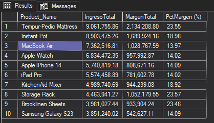

Insight: 

-  El producto _Tempur-Pedic Mattress_ es el líder en ventas y en margen de ganancia con $9.06 Millones y 23.55% respectivamente. Seguido de Instant Pot con $8.90 Millones y 18.98% de Margen. 
- Se identificó que 5 de los 10 productos más vendidos pertenecen a la categoría _Electronics_, todos estos con un margen que ronda entre los 13.9% y 14.1% que justamente representa un valor bajo frente a otras categorías
- La empresa podría priorizar el crecimiento de sus productos líderes como _Tempur-Pedic Mattress_ y  _Storage Rack_ que combinan Ingresos y Margenes Altos superiores al 23%, mientras se analiza la estrategia de precios y costos de los productos de la categoría _Electronics_ ya que genera menor ganancia relativa por venta.


### 3. Ventas Totales Por Región

#### ¿Como se comparan las ventas totales, la ganancia y la cantidad de de órdenes entre las 4 regiones donde opera el negocio?

Se determinó el Ingreso, Margen, Porcentaje de Margen y cantidad de Ordenes por Región utilizando las funciones SUM, COUNT, GROUP BY y ORDER BY para comparar las relaciones entre las distintas regiones donde opera el negocio.

```sql
SELECT 
	g.Region,
	FORMAT(SUM(f.Revenue), 'N2') AS  IngresoTotal,
	FORMAT(SUM(f.Profit), 'N2') AS MargenTotal,
	CAST(	
		(SUM(f.Profit) * 100.0)/ SUM(f.Revenue) AS DECIMAL(10,2) 
		) AS [PctMargen (%)],
	COUNT(DISTINCT f.Order_ID) AS CntOrdenes
FROM Fact_Sales AS f
INNER JOIN Dim_Geography AS g ON g.Geo_ID = f.Geo_ID
GROUP BY g.Region
ORDER BY SUM(f.Revenue) DESC
```
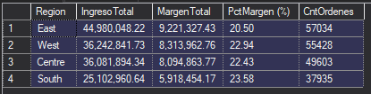

**Insight:** 

- La región Este se posiciona como la principal fuente de ingresos com $44.98M y 57034 órdenes, superando casi por el doble a la región Oeste que posee $25.10M y 37935 órdenes. Asi mismo, la región Este posee el peor margen de las 4 regiones con 20.50% y South generó el menor ingreso ($25.102M) pero alcanzó el mejor margen porcentual (23.58%).
- Se sugiere la realización de un estudio de rentabiliad en la región Este para identificar si se debe a un mercado con mayor presencia de categorías de bajo margen tal como es  Electronics.
- Si South tiene el mayor margen con menor operación de ventas, se debería evaluar el enfoque comercial utilizado para ver si es viable aplicarlo a la región Este sin sacrificar su volumen de ventas.


### 4. Rentabilidad de los productos

#### ¿Como se puede clasificar a cada producto según su nivel de rentabilidad (alta, media o baja) para priorizar decisiones comerciales?

Se encontró la rentabilidad de los productos mediante una clasificación de margen alto, medio y bajo. Se utilizaron las funciones SUM, GROUP BY, ORDER BY y CASE WHEN.

- El margen alto corresponde a un porcentaje mayor o igual a 33%.
- El margen medio corresponde a un porcentaje mayor o igual a 17% y menor a 33%.
- El margen bajo corresponde a un porcentaje menor a 17%.

```sql
SELECT 
	p.Product_Name,
	FORMAT(SUM(f.Revenue), 'N2') AS  IngresoTotal,
	FORMAT(SUM(f.Profit), 'N2') AS MargenTotal,
	CAST(	
		(SUM(f.Profit) * 100.0)/ SUM(f.Revenue) AS DECIMAL(10,2) 
		) AS [PctMargen (%)],
	CASE 
		WHEN (SUM(f.Profit) * 100.0)/ SUM(f.Revenue) >= 33 THEN 'Alto'
		WHEN (SUM(f.Profit) * 100.0)/ SUM(f.Revenue) >= 17 THEN 'Medio'
		ELSE 'Bajo'
	END AS ClasificacionRentabilidad
FROM Fact_Sales  AS f
INNER JOIN Dim_Product AS p ON p.Product_ID = f.Product_ID
GROUP BY p.Product_Name
ORDER BY [PctMargen (%)] DESC, SUM(f.Profit) DESC, SUM(f.Revenue) DESC
```

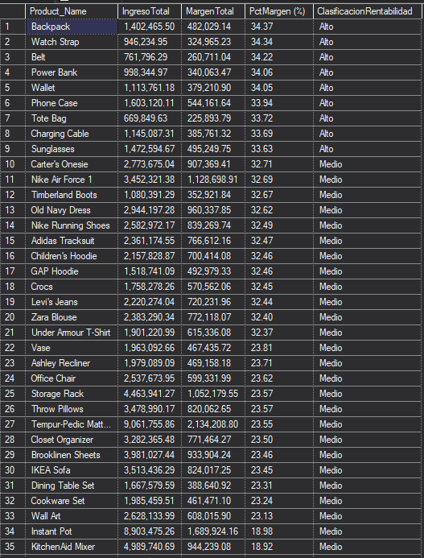

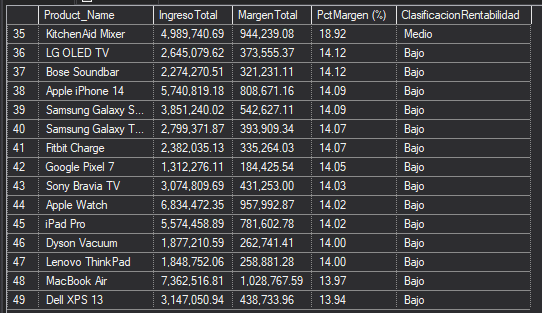


**Insight:**
- Los productos clasificados con rentabilidad alta son en su gran mayoría del segmento de Accesories con márgenes entre 33.63% a a 34.37%. Mientras que los del segmento Medio son principalmente de Clothin & Apparel con márgenes cercanos al 32.00% y Home & Furniture con márgenes entre 18% y 24%.
- En el segmento de margen bajo se encuentra la categoría Electronics con un márgen aproximado de 13.9%.
- La empresa podría tratar a Clothin & Apparel con una prioridad comercial similar a la de Accesories pues poseen margenes bastante cercanos.
- Tratar a los productos cercanos a posicionarse en el segmento de margen bajo como: Instant Pot y Kitchen Aid Mixer priorizando su volumen de venta para evitar la caída en la clasificación.

### 5. Evolución Mensual de Ingresos

#### ¿Como ha evolucionado el ingreso mes a mes durante 2023 y 2024? ¿Existe algun patron de estacionalidad?

Se obtuvo la evolucion mes a mes de los Ingresos y el Margen utilizando un CTE llamado `Ventas Mensuales` a través de la funciones YEAR, MONTH, DATENAME para desagregar las fechas y SUM, COUNT y GROUP BY para generar las agrupaciones numéricas.

Sobre ese resultado se aplicó la window function LAG() para calcular el crecimiento de ingreso del mes anterior y asímismo se calculó el porcentaje de crecimiento mes a mes.

```sql
WITH VentasMensuales as(
	SELECT 
		YEAR(f.Order_Date) AS Anio,
		MONTH(f.Order_Date) AS NumMes,
		DATENAME(MONTH, f.Order_Date) AS Mes,
		SUM(f.Revenue) AS IngresoTotal,
		SUM(f.Profit) AS MargenTotal,
		COUNT(DISTINCT Order_ID) as TotalOrdenes
	FROM Fact_Sales AS f
	GROUP BY YEAR(f.Order_Date), MONTH(f.Order_Date), DATENAME(MONTH, f.Order_Date)
)
SELECT 
	Anio,
	NumMes,
	Mes,
	FORMAT(IngresoTotal, 'N2') as IngresoTotalMes,
	FORMAT(MargenTotal, 'N2') as MargenTotalMes,
	TotalOrdenes,
	FORMAT( LAG(IngresoTotal, 1) OVER(ORDER BY Anio, NumMes) , 'N2') AS IngresoMesAnterior,
	CAST(
		(IngresoTotal -	LAG(IngresoTotal, 1) OVER(ORDER BY Anio, NumMes) ) * 100.0 /
		LAG(IngresoTotal, 1) OVER(ORDER BY Anio, NumMes) 
		AS DECIMAL(10,2)) AS [CrecimientoIngresoMesAnterior(%)]
FROM VentasMensuales
ORDER BY Anio ASC, NumMes ASC
```

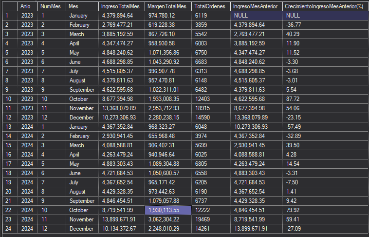
 
 **Insight:**

 - Se pudo detectar una consistencia mes a mes entre ambos años, febrero tiene una caída similar en periodos del 2023 y 2024 con un -36.77% y -32.89% respectivamente.
 - En la transición Mayo-Junio se muestran caídas leves pero repetidas entre ambos años, con un -3.37% y 3.31%, confirmando un ciclo estacional recurrente.
 - Se pudo determinar una estacionalidad marcada en el último trimestre (Oct-Nov-Dic) ya que se concentra la mayor cantidad de ventas de todo el año.
 - Se pudo identificar al mes de Febrero como el mes más débil del año en cuanto a Ingresos, Margen y Ordenes.
  - La empresa debería concentrar su presupuesto de inventario y logística en el último trimestre del año (Oct-Nov-Dic), que representa aproximadamente más del 35% del ingreso anual.
 - También se debería construir campañas de reactivación comercial para febrero, puesto que es el punto más frágil de nuestra operación comercial anual y tiene un gran margen de mejora.

### 6. Concentración del Ingreso por Estado

#### ¿Que estados concentran el 80% del ingreso total de la empresa? ¿Vale la pena distribuir el esfuerzo comercial por igual entre los 47 estados?

Se utilizó un CTE llamado `IngresoPorEstado` y sobre ese se aplicó otro CTE llamado `IngresoAcumulado` con las funciones de ventana:
- SUM() OVER (ORDER BY ... DESC) para el cálculo del ingreso acumulado estado por estado de mayor a menor
- SUM() OVER() para el cálculo total general de ingresos en cada fila.

Con esa información se calculó el porcentaje de individual y acumualado de cada estado sobre el total.

``` sql
WITH IngresoPorEstado AS (
	SELECT
		g.State as Estado,
		SUM(f.Revenue) as IngresoEstado
	FROM Fact_Sales as f
	INNER JOIN Dim_Geography as g on f.Geo_ID = g.Geo_ID
	GROUP BY g.State
),
IngresoAcumulado AS (
	SELECT 
		Estado,
		IngresoEstado,
		SUM(IngresoEstado) OVER (ORDER BY IngresoEstado DESC) as IngresoAcumulado,
		SUM(IngresoEstado) OVER() AS IngresoTotalGral
	FROM IngresoPorEstado
)
SELECT
	Estado,
	FORMAT ( IngresoEstado, 'N2') AS IngresoEstado_,
	CAST( ( IngresoEstado * 100.0 ) / ( IngresoTotalGral) AS DECIMAL(10,2) ) as PctIndividual,
	FORMAT ( IngresoAcumulado, 'N2' ) AS IngresoAcumulado_,
	CAST ( ( IngresoAcumulado * 100.0 ) / ( IngresoTotalGral) AS DECIMAL(10,2) ) as PctAcumulado,
	FORMAT ( IngresoTotalGral, 'N2' ) AS IngresoTotalGral_
FROM IngresoAcumulado
ORDER BY IngresoEstado DESC;
```

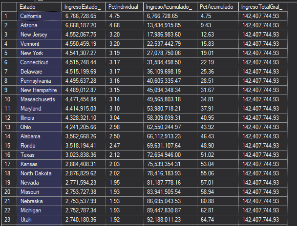
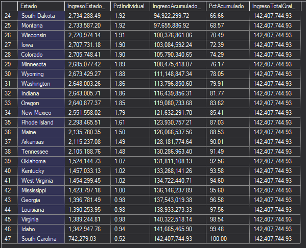

**Insight:**

- Los resultados confirman que el principio de Pareto del 80-20 (80% de las resultados(ingresos) provienen del 20% de causas (estados)) no se cumple en las operaciones de la empresa.
- El porcentaje acumulado de ingresos alcanza el 81.77% en el estado de Indiana, que ocupa el puesto 32 de 47. Es decir, se necesita el 68% de los estados para alcanzar el 80% de los ingresos totales de $142.4M. Un indicador muy lejano al establecido por el principio.
- California es el estado líder y aporta 4.75% del total, los 12 primeros estados aportan en un rango muy similar (3.04% a 4.75% de ingresos respeto del total).
- La empresa debería descartar una estrategia de priorización comercial basada en geografía, puesto que no existe un grupo dominante de estados clave sobre el cual concentrar fuerzas comerciales. La operación esta distribuida homogéneamente a nivel nacional.
- La empresa debería plantear criterios de priorización en otras dimensiones como producto y categoría, donde se encuentran más concentraciones de rentabilidad.

### 7. Clientes Recurrentes vs. Compradores Únicos

#### ¿Qué proporción de clientes ha realizado más de una compra, frente a los que solo compraron una vez?

Se utilizó un CTE llamado `Clasificacion_Cliente` para segmentar a los clientes como recurrentes o únicos con las funciones COUNT, CASE WHEN.
Luego se obtuvo el porcentaje de Clientes utilizando la funcion de ventana SUM() OVER().

``` sql sql
WITH Clasificacion_Cliente as (
	SELECT
		c.Customer_Name,
		COUNT(DISTINCT f.Order_ID) AS Total_Compras,
		CASE 
			WHEN COUNT(DISTINCT f.Order_ID) > 1 Then 'Recurrente'
			ELSE 'Unico'
		END AS Tipo_Cliente
	FROM Fact_Sales as f
	INNER JOIN Dim_Customer as c ON c.Customer_ID = f.Customer_ID
	GROUP BY c.Customer_Name
)
SELECT 
	Tipo_Cliente,
	COUNT(1) AS CantidadClientes,
	SUM(COUNT(1)) OVER() AS TotalClientes, 
	CAST(
		COUNT(1) * 100.0 / 
		SUM(COUNT(1)) OVER() 
		AS decimal(10,2) ) AS PctClientes
FROM Clasificacion_Cliente
GROUP BY Tipo_Cliente
ORDER BY CantidadClientes DESC;
```

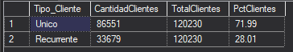


**Insight:**
- Los resultados muestran que el 72% de los clientes son compradores únicos en el periodo 2023-2024, mientras que 28.01% de los clientes volvieron a comprar al menos una segunda vez. Esto indica que el negocio depende bastante de la adquisición continua de nuevos clientes lo que representa un riesgo comercial por falta de fidelización.
-  Se deben reforzar las estrategias de retención y fidelización de clientes, seguimientos post-compra y campañas de compras redirigidas antes de seguir enfocando las inversiones en adquisición de nuevos clientes.

### 8. Tasa de Crecimiento Mensual Por Categoría

Se halló la tendencia de crecimiento por Categoría utilizando dos CTEs encadenados, `VentasMensualesCategoria`agrupa los ingresoss por categoria, año y mes. 

El segundo CTE `CrecimientoMensual` hace uso de la función de ventana LAG para calcular el ingreso del mes anterior y la tasa de crecimiento porcentual entre mes y mes. 

Finalmente, se calcula el promedio de crecimiento porcentual de cada categoría y se hace un conteo de meses en crecimiento y en caida
```sql
WITH VentasMensualesCategoria as(
	SELECT 
		p.Category,
		YEAR(f.Order_Date) AS Anio,
		MONTH(f.Order_Date) AS NumMes,
		DATENAME(MONTH, f.Order_Date) AS Mes,
		SUM(f.Revenue) AS IngresoTotal
	FROM Fact_Sales AS f
	INNER JOIN Dim_Product as p on p.Product_ID = f.Product_ID
	GROUP BY p.Category, YEAR(f.Order_Date), MONTH(f.Order_Date), DATENAME(MONTH, f.Order_Date)
),
CrecimientoMensual as (
SELECT 
	Category, 
	Anio,
	NumMes,
	Mes,
	FORMAT(IngresoTotal, 'N2') as IngresoTotalMes,
	FORMAT( LAG(IngresoTotal, 1) OVER(PARTITION BY Category ORDER BY Anio, NumMes) , 'N2') AS IngresoMesAnterior,
	CAST(
		(IngresoTotal -	LAG(IngresoTotal, 1) OVER(PARTITION BY Category ORDER BY Anio, NumMes) ) * 100.0 
		/ LAG(IngresoTotal, 1) OVER(PARTITION BY Category  ORDER BY Anio, NumMes) 
		AS DECIMAL(10,2)) AS Pct_Crecim_Mes_Anterior
FROM VentasMensualesCategoria
)
SELECT
	Category,
	ROUND( AVG(Pct_Crecim_Mes_Anterior), 2) AS CrecimientoPromMensual,
	SUM(CASE
			WHEN Pct_Crecim_Mes_Anterior > 0 THEN 1 
			ELSE 0
		END) AS CntMesEnCrecimiento,
	SUM(CASE
			WHEN Pct_Crecim_Mes_Anterior < 0 THEN 1 
			ELSE 0
		END) AS CntMesEnCaida
FROM CrecimientoMensual
WHERE Pct_Crecim_Mes_Anterior is NOT NULL
GROUP BY Category
ORDER BY CrecimientoPromMensual DESC
```

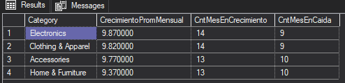

**Insight:**

- Home & Furniture es la categoría mas irregular pues tiene el menor crecimiento promedio (9.37%), 13 meses en crecimiento y 10 en caida.
- El promedio de crecimiento de las 4 categorías que se sitúa entre 9.3% y 10% no debe interpretrase como un crecimiento sostenido pues gran parte de esta cifra se debe a la temporada alta  de octubre, noviembre y diciembre.
- Las categorías de Clothing & Apparel y Electronics muestran la mejor tasa de crecimiento con 9.87% y 9.82%. La empresa debería seguir impulsando esa estabilidad y evaluar si es aplicable a las categorías de menor crecimiento.


### 9. Matriz de Desempeño Categoría-Región

#### ¿Qué combinaciones de categoría y región presentan el mejor y el peor desempeño conjunto de ingreso y margen?

Se halló el desempeño cruzado de cada combinación categoría y región agrupando Sales, Product y Geograpgy con las funciones SUM para Ingresos y Margenes Totales. Se utilizó la funcion de ventana RANK () OVER(ORDER BY ... DESC) para obtener un ranking organizado de mejor a peor desempeño por margen.

```sql
SELECT
	p.Category,
	g.Region,
	FORMAT(SUM(f.Revenue), 'N2') as IngresoTotal,
	FORMAT(SUM(f.Profit), 'N2') as MargenTotal, 
	CAST( SUM(f.Profit) * 100.0 /sum(f.Revenue) AS DECIMAL(10,2) ) AS PctMargen,
	RANK() OVER(ORDER BY SUM(f.Profit) * 100.0 /sum(f.Revenue) DESC ) AS RankingMargen
FROM Fact_Sales as f
INNER JOIN Dim_Product AS p on p.Product_ID = f.Product_ID
INNER JOIN Dim_Geography AS g on g.Geo_ID = f.Geo_ID
GROUP BY p.Category, g.Region
```

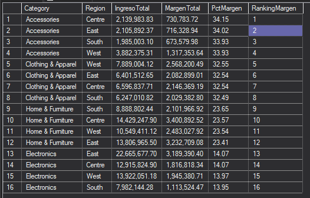

**Insight:**

- Se pudo evidenciar que el margen está determinado por la categoría y no por la geografía. Las 16 combinaciones se agrupan en 4 bloques perfectamente definidos por categoría (Accessories 33.9%-34.2%, Clothing & Apparel 32.5%-32.6%, Home & Furniture 23.4%-23.7%, Electronics 13.9%-14.1%)
- En cuanto a la región que posee el menor margen de todas la cual es East, se evidencia que no se debe a que vende un mix de producto diferente a las demás regiones sino que tiene simplemente una mayor venta de Electronics en general con $22.67M.
- La empresa debería impulsar sus esfuerzos comerciales en categorías de mayor margen como Accessories y Clothing & Apparel dentro de la región East, para que la participación relativa del del total de ventas de la región East suba.

## Conclusiones del Proyecto
- Este análisis proporcionó información importante sobre las áreas donde Corwell Group puede mejorar su rentabilidad y estrategia comercial.
- Uno de los descubrimientos principales fue que el margen de ganancia está determinado por la categoría de producto y no por la geografía, con Electronics como la categoría de mayor volumen pero menor rentabilidad.
- Se detectaron niveles de concentración de ingreso distribuidos de forma prácticamente uniforme entre los 47 estados, descartando la geografía como criterio de priorización comercial.
- Para abordar estos hallazgos, la empresa debe tomar la iniciativa y enfocarse en revisar la estructura de costos de Electronics. 
- Es fundamental fortalecer las estrategias de retención de clientes, dado que la mayoría de compradores realizan compras únicas. 
- Resulta vital aprovechar la estacionalidad del último trimestre para optimizar inventario y presupuesto comercial.