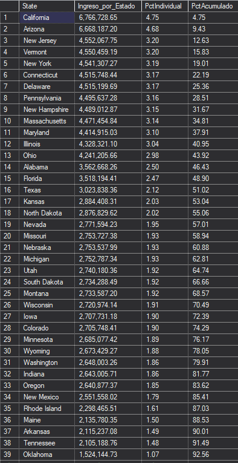
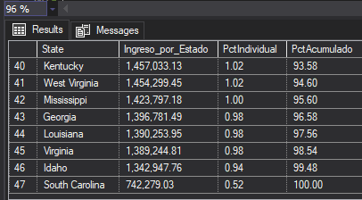

# Proyecto SQL-Server-Commercial-Analytics
Proyecto Integral de SQL Server para Analitica de Negocios
## Resumen (overview)
### Sobre el negocio
Corwell Group es una empresa de distribución y venta retail de multicategoría con operaciones y presencia en Estados Unidos.

El departamento de estrategia comercial de Corwell Group desea identificar en qué productos, categorías y mercados regionales debe enfocar sus esfuerzos de crecimiento y rentabilidad, priorizando decisiones de portafolio sobre una base de datos sólida en lugar de intuición.

### Objetivo del proyecto
_Utilizar el lenguaje **SQL** dentro del entorno de **SQL Server Management Studio**_ para estructurar, normalizar y realizar análisis exploratorio de la información transaccional del negocio con el fin de entregar al área comercial recomendaciones accionables que permitan implementar mejoras practicas en su estrategia comercial, optimizar sus procesos y aumentar la rentabilidad._

### Herramientas y Metodología

- **Motor de Base De Datos**: SQL Server Management Studio (SMSS)
- **Lenguaje**: SQL (DDL, DML, DQL)
- **Metodología**: Limpieza de Datos (Data Cleaning), Análisis Exploratorio de Datos(EDA) y Generación de Insights Accionables.


## Estructura del Proyecto
- [Sobre los Datos](#sobre-los-datos)
- [Tareas](#tareas)
- [Arquitectura y Modelado de Datos](#arquitectura-y-modelado-de-datos)
- [Limpieza de Datos](#limpieza-de-datos)
- [Análisis Exploratorio de Datos e Insights](#análisis-exploratorio-de-datos-e-insights)
- [Conclusiones y Recomendaciones](#conclusiones-y-recomendaciones)

## Sobre los datos

El proyecto utiliza un dataset que está compuesto por una tabla con 200,000 registros distribuidos en 14 columnas, el cual contiene información sobre las transacciones de ventas de una empresa retail como: fecha de transacción, información del cliente, producto, cantidad, precio unitario, ingreso y ganancia.

Se puede acceder al dataset original [aquí](https://www.kaggle.com/datasets/yashyennewar/product-sales-dataset-2023-2024).


A continuación se muestra la estructura de las tablas del dataset:

### Estructura del archivo `sales.csv`

| Columna | Descripción |
|----------|-------------|
| Order_ID | Identificador único de cada pedido. |
| Order_Date | Fecha en la que se realizó la transacción. |
| Customer_Name | Nombre del cliente que realizó la compra. |
| City | Ciudad de residencia del cliente. |
| State | Estado de residencia del cliente. |
| Region | Región geográfica donde se ubica el cliente (Este, Oeste, Sur o Centro). |
| Country | País donde se realizó la venta (Estados Unidos). |
| Category | Categoría principal del producto (por ejemplo, Accesorios, Ropa y Vestimenta). |
| Sub_Category | Subcategoría del producto dentro de la categoría principal (por ejemplo, Ropa deportiva, Bolsos). |
| Product_Name | Nombre o descripción del producto comercializado. |
| Quantity | Cantidad de unidades compradas. |
| Unit_Price | Precio unitario del producto, expresado en dólares estadounidenses (USD). |
| Revenue | Ingresos totales generados por la venta, calculados como **Cantidad × Precio Unitario**. |
| Profit | Ganancia neta obtenida en la transacción. |

## Tareas (Task)

En este proyecto, se ayudará al departamento comercial de Corwell Group a responder lo siguiente:

1. **Ingreso y Margen Total por Cateogoría de Producto:** 
¿Cuál es el ingreso total y la ganancia total generados por cada categoría de producto, y qué porcentaje de margen representa cada una?

2. **Mejores Productos del Catálogo Por Margen:** ¿Cuáles son los 10 productos que generan mayor ingreso para la empresa?

3. **Ventas Totales por Región:** ¿Cómo se comparan las ventas totales, la ganancia y el número de órdenes entre las 4 regiones donde opera Corwell Group?

4. **Rentabilidad de los productos:** ¿Cómo se puede clasificar a cada producto según su nivel de rentabilidad (alta, media o baja) para priorizar decisiones comerciales?

5. **Evolución Mensual de Ingresos:** ¿Cómo ha evolucionado el ingreso mes a mes durante 2023 y 2024? ¿Existen patrones de estacionalidad?

6. **Distribución de Ingresos por Estado:** ¿Qué estados concentran el 80% del ingreso total de la empresa? ¿Vale la pena distribuir el esfuerzo comercial por igual entre todos los estados?

7. **Frecuencia de compra por cliente:** ¿Qué proporción de clientes ha realizado más de una compra, frente a los que solo compraron una vez?

8. **Tasa de crecimiento mensual por categoría:** ¿Cuál es la tasa de crecimiento mes a mes del ingreso por categoría de producto, y qué categorías muestran una tendencia sostenida de crecimiento o caída?

9. **Ranking de productos por categoría:** ¿Cuáles son los productos más y menos rentables dentro de cada categoría, ordenados por ranking interno?

10. **Detección de caída de ventas:** ¿Existen productos con una caída sostenida de ventas durante 2 o más meses consecutivos que ameriten una alerta temprana?

11. **Segmentación de clientes por valor de compra:** ¿Cómo se segmentan los clientes según su valor de compra acumulado (en cuartiles), y qué porcentaje del ingreso total aporta el cuartil superior?

12. **Contribución regional al margen de ganancia:** ¿Cuál es la contribución acumulada de cada región al margen de ganancia total de la empresa?

13. **Matriz de desempeño Categoría Región:**¿Qué combinaciones de categoría y región presentan el mejor y el peor desempeño conjunto de ingreso y margen?

14. **Detección de outliersen Precio Unitario:**¿Existen productos con un precio unitario anormalmente alto o bajo respecto al promedio de su subcategoría, que ameriten revisión de pricing?

## Arquitectura y Modelado de Datos

El dataset original consistía en un archivo plano desnormalizado en formato (.csv). Para optimizar el almacenamiento y facilitar el análisis, se optó por diseñar un modelo relacional de datos para el almacenamiento y segmentación de la infrormación. Este modelo  se compone de las siguientes tablas:

- `Dim_Customers`: (Dimensión de Clientes) Contiene nombres y apellidos del cliente.
- `Dim_Geography`: (Dimensión de Geografía) Contiene información geográfica como ciudad, estado, región y país.
- `Dim_Products`: (Dimensión de Productos) Contiene información de los productos como nombre, categoría y subcategoría.
- `Fact_Sales`: (Tabla de Hechos de Ventas) Contiene información sobre las ventas como fecha de transacción, cantidad, precio unitario, ingreso y ganancia.

```sql
-- ==============================
-- 1. NORMALIZACION DE LA DATA
-- ==============================

-- ===============================================
-- a) Tabla Dimensional de Clientes (Dim_Customer)
-- ===============================================

-- Creación de tabla Dim_Customer

CREATE TABLE Dim_Customer (
	Customer_ID		INT IDENTITY(101,1) NOT NULL,
	Customer_Name	VARCHAR(100) NOT NULL,
	CONSTRAINT PK_Dim_Customer PRIMARY KEY (Customer_ID) );

-- Inserción de Data en Dim_Customer

INSERT INTO Dim_Customer (Customer_Name)
	SELECT 
		DISTINCT Customer_Name
	FROM sales
;

-- ===============================================
-- b) Tabla Dimensional de Productos (Dim_Product)
-- ===============================================

-- Creación de tabla Dim_Product

CREATE TABLE Dim_Product (
	Product_ID		INT IDENTITY(1,1) NOT NULL,
	Product_Name	VARCHAR(100) NOT NULL,
	Sub_Category	VARCHAR(50),
	Category		VARCHAR(50),
	CONSTRAINT PK_Dim_Product PRIMARY KEY (Product_ID) ) ;

-- Inserción de Data en Dim_Product

INSERT INTO Dim_Product (Product_Name, Sub_Category, Category)
	SELECT 
		DISTINCT Product_Name,
		Sub_Category,
		Category
	FROM sales
	ORDER BY Category ASC, Sub_Category ASC, Product_Name ASC;

-- ===============================================
-- c) Tabla Dimensional de Geography (Dim_Geography)
-- ===============================================

-- Creación de tabla Dim_Geography

CREATE TABLE Dim_Geography (
	Geo_ID			INT IDENTITY(1,1) NOT NULL,
	City			VARCHAR(100),
	State			VARCHAR(50),
	Region			VARCHAR(20),
	Country			VARCHAR(50),
	CONSTRAINT PK_Dim_Geography PRIMARY KEY (Geo_ID) ) ;

-- Inserción de Data en Dim_Geography

INSERT INTO Dim_Geography (City, State, Region, Country)
	SELECT
		DISTINCT City,
		State,
		Region,
		Country
	FROM sales 
	ORDER BY Region ASC, State ASC, City ASC

-- ===============================================
-- d) Tabla de Hechos de Ventas (Fact_Sales)
-- ===============================================

-- Creación Tabla De Hechos de Ventas (Fact_Sales)

CREATE TABLE Fact_Sales (
	Order_ID		INT NOT NULL,
	Customer_ID		INT NOT NULL,
	Product_ID		INT NOT NULL,
	Geo_ID			INT NOT NULL,
	Order_Date		DATE NOT NULL,
	Quantity		INT,
	Unit_Price		DECIMAL(10,2),
	Revenue			DECIMAL(10,2),
	Profit			DECIMAL(10,2),
	CONSTRAINT PK_Fact_Sales PRIMARY KEY (Order_ID),
	CONSTRAINT FK_Fact_Customer FOREIGN KEY (Customer_ID)
		REFERENCES Dim_Customer(Customer_ID),
	CONSTRAINT FK_Fact_Product FOREIGN KEY (Product_ID)
		REFERENCES Dim_Product(Product_ID),
	CONSTRAINT FK_Fact_Geo FOREIGN KEY (Geo_ID)
		REFERENCES Dim_Geography(Geo_ID),
	CONSTRAINT CHK_Quantity CHECK(Quantity > 0),
	CONSTRAINT CHK_Unit_Price CHECK(Unit_Price >= 0),
	CONSTRAINT CHK_Revenue CHECK(Revenue >= 0)
);

-- Inserción de Data en Fact_Sales

INSERT INTO Fact_Sales(Order_ID, Customer_ID, Product_ID, Geo_ID, Order_Date, Quantity, Unit_Price, Revenue, Profit)
SELECT
		s.Order_ID,
		c.Customer_ID,
		p.Product_ID,
		g.Geo_ID,
		FORMAT(CAST(s.Order_Date as date), 'yyyy-MM-dd') AS Order_Date,
		s.Quantity,
		s.Unit_Price,
		s.Revenue,
		s.Profit
FROM sales s
JOIN Dim_Customer c ON c.Customer_Name = s.Customer_Name
JOIN Dim_Product p ON p.Product_Name = s.Product_Name
					AND p.Sub_Category = s.Sub_Category
					AND p.Category = s.Category
JOIN Dim_Geography g ON g.City = s.City
					AND g.State = s.State
					AND g.Region = s.Region
					AND g.Country = s.Country;
```

A continuación se muestra el diagrama entidad-relación del modelo relacional de datos:


## Limpieza de datos
Antes de realizar el análisis, es fundamental asegurar que los datos estén limpios y completos. Se deben verificar la integridad de los datos, la consistencia de las fórmulas y la calidad de los registros. Los pasos realizados en esta etapa fueron:

### 1. Verificación de valores nulos o faltantes:

Se verificó la existencia de valores faltantes en los campos clave dentro de la tabla `sales`: 
- `Order_ID`
- `Order_Date`
- `Customer_Name`
- `City`
- `Quantity`
- `Unit_Price`
- `Revenue`
- `Profit`


```sql
-- =============================
-- Valores Nulos o Faltantes
-- =============================

-- Verificacion de valores faltantes en la tabla Dim_Customer

SELECT COUNT(1) as ValoresFaltantesCustomer
FROM Dim_Customer
WHERE Customer_Name is NULL;

-- Verificación de valores faltantes en la tabla Dim_Product

SELECT COUNT(1) as ValoresFaltantesProduct
FROM Dim_Product
WHERE Product_Name is NULL
		or Category is NULL
		or Sub_Category is NULL;

-- Verificacion de valores faltantes en la tabla Dim_Geography

SELECT COUNT(1) as ValoresFaltantesGeo
FROM Dim_Geography
WHERE City is NULL 
		or State IS NULL
		or Region IS NULL
		or Country IS NULL;

-- Verificacion de valores faltantes en la tabla Fact_Sales

SELECT COUNT(1) as ValoresFaltantesFact
FROM Fact_Sales
WHERE  Order_ID IS NULL
	OR Order_Date IS NULL
    OR Customer_Name IS NULL
    OR Product_Name IS NULL
    OR City IS NULL
    OR Quantity IS NULL
    OR Unit_Price IS NULL
    OR Revenue IS NULL
    OR Profit IS NULL;
```


### 2. Verificación de valores duplicados:

```sql
-- =============================
-- Valores Duplicados
-- =============================

-- Verificacion de valores duplicados en la tabla Fact_Sales

SELECT Order_ID, COUNT(1) as ValoresDuplicados
FROM Fact_Sales
GROUP BY Order_ID
HAVING COUNT(1) > 1;
```


### 3. Verificación de inconsistencias:

```sql
-- ================================
-- Verificacion de Inconsistencias
-- ===============================

-- Verificacion de Formulas en Campos Calculados de Revenue

SELECT COUNT(1) AS CalculoIncorrecto
FROM sales
WHERE ROUND(Unit_Price * Quantity, 2) <> Revenue;

-- Verificacion de inconsistencia (se debe verificar que Profit no exceda a Revenue)

SELECT COUNT(1) AS Inconsistencia_Profit_Revenue
FROM sales
WHERE Profit > Revenue;
;
```


## Análisis Exploratorio de Datos e Insights

### 1.  Ingreso y Margen Total por Categoria de Producto

¿Cual es el ingreso total y la ganancia total generados por cada categoría de producto, y que porcentaje de margen representa cada una?

```sql
SELECT 
	p.Category,
	FORMAT(SUM(f.Revenue), 'N2') AS  IngresoTotal,  -- Formato de Separación
	FORMAT(SUM(f.Profit), 'N2') AS MargenTotal,		-- Formato de Separación
	CAST(	
		(SUM(f.Profit) * 100.0)/ SUM(f.Revenue) AS DECIMAL(10,2) 
		) AS [PctMargen (%)]
FROM Fact_Sales AS f
INNER JOIN Dim_Product AS p ON p.Product_ID  = f.Product_ID
GROUP BY p.Category
ORDER BY 
	[PctMargen (%)] DESC;
```


Insight: XXXXXXXXXXXXXXXXXXXXXXXXXXXXXXXXXXXX

### 2.  Mejores Productos del Catálogo por Margen

¿Cuales son los productos que generan mayor margen para la empresa?

```sql
SELECT TOP 10
	p.Product_Name,
	FORMAT(SUM(f.Revenue), 'N2') AS  IngresoTotal,
	FORMAT(SUM(f.Profit), 'N2') AS MargenTotal,
	CAST(	
		(SUM(f.Profit) * 100.0)/ SUM(f.Revenue) AS DECIMAL(10,2) 
		) AS [PctMargen (%)]
FROM Fact_Sales AS f
JOIN Dim_Product as p ON p.Product_ID = f.Product_ID
GROUP BY p.Product_Name
ORDER BY SUM(f.Revenue) DESC
```


Insight: XXXXXXXXXXX

### 3. Ventas Totales Por Región

¿Como se comparan las ventas totales, la ganancia y la cantidad de de órdenes entre las 4 regiones donde opera el negocio?

```sql
SELECT 
	g.Region,
	FORMAT(SUM(f.Revenue), 'N2') AS  IngresoTotal,
	FORMAT(SUM(f.Profit), 'N2') AS MargenTotal,
	CAST(	
		(SUM(f.Profit) * 100.0)/ SUM(f.Revenue) AS DECIMAL(10,2) 
		) AS [PctMargen (%)],
	COUNT(DISTINCT f.Order_ID) AS CntOrdenes
FROM Fact_Sales AS f
INNER JOIN Dim_Geography AS g ON g.Geo_ID = f.Geo_ID
GROUP BY g.Region
ORDER BY SUM(f.Revenue) DESC
```


Insight: XXXXXXXXXXX

### 4. Rentabilidad de los productos

¿Como se puede clasificar a cada producto según su nivel de rentabilidad (alta, media o baja) para priorizar decisiones comerciales?

```sql
SELECT 
	p.Product_Name,
	FORMAT(SUM(f.Revenue), 'N2') AS  IngresoTotal,
	FORMAT(SUM(f.Profit), 'N2') AS MargenTotal,
	CAST(	
		(SUM(f.Profit) * 100.0)/ SUM(f.Revenue) AS DECIMAL(10,2) 
		) AS [PctMargen (%)],
	CASE 
		WHEN (SUM(f.Profit) * 100.0)/ SUM(f.Revenue) >= 33 THEN 'Alto'
		WHEN (SUM(f.Profit) * 100.0)/ SUM(f.Revenue) >= 17 THEN 'Medio'
		ELSE 'Bajo'
	END AS ClasificacionRentabilidad
FROM Fact_Sales  AS f
INNER JOIN Dim_Product AS p ON p.Product_ID = f.Product_ID
GROUP BY p.Product_Name
ORDER BY [PctMargen (%)] DESC, SUM(f.Profit) DESC, SUM(f.Revenue) DESC
```


Insight: XXXXXXXXXXX

### 5. Evolución Mensual de Ingresos

¿Como ha evolucionado el ingreso mes a mes durante 2023 y 2024? ¿Existe algun patron de estacionalidad?

```sql
SELECT 
    YEAR(f.Order_Date) AS Anio,
    MONTH(f.Order_Date) AS NumMes,
    DATENAME(MONTH, f.Order_Date) AS Mes,
    FORMAT(SUM(f.Revenue), 'N2') AS IngresoTotal,
    FORMAT(SUM(f.Profit), 'N2') AS MargenTotal,
    COUNT(DISTINCT f.Order_ID) AS TotalOrdenes
FROM Fact_Sales AS f
GROUP BY YEAR(f.Order_Date), MONTH(f.Order_Date), DATENAME(MONTH, f.Order_Date)
ORDER BY Anio ASC, NumMes ASC;
```


